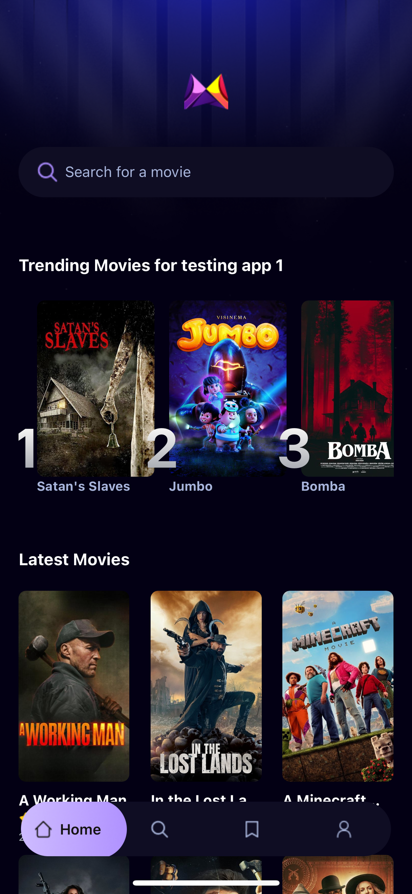
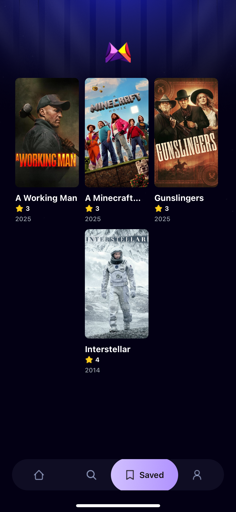

# 🎬 Movie App - Expo React Native

A beautiful movie app built with **React Native + Expo**, inspired by [JavaScript Mastery](https://github.com/adrianhajdin).  
This app allows users to discover movies, view details, and save them to favorites using Appwrite.

## ⚙️ Tech Stack

- Expo (React Native)
- TypeScript
- TMDB API
- Appwrite
- NativeWind (Tailwind for React Native)
- Context API (Auth)

---

## 📱 Screenshots

### Login Page


### Register Page\


### Home Page  


### Detail Page  


### Saved Movie Page  


### Profile Page (Update soon)


---

## 🚀 Getting Started

### 1. Clone Repository

```bash
git clone https://github.com/alfiansaheriks/movieflix.git
cd movie-app
```

### 2. Install Dependencies

```bash
npm install
```

### 3. Run Project with Expo

```bash
npx expo start
```

> 📱 Open the QR code using **Expo Go** on your iPhone or Android to preview the app.

---

## 🔐 Environment Variables

Create a `.env` file in the root directory:

```env
TMDB_API_KEY=your_tmdb_api_key
APPWRITE_ENDPOINT=https://your-appwrite-endpoint.com
APPWRITE_PROJECT_ID=your_project_id
APPWRITE_DATABASE_ID=your_database_id
APPWRITE_COLLECTION_ID=your_collection_id
```

---

## 📁 Folder Structure

```
├── assets/              # Static images and icons
├── components/          # Reusable UI components
├── constants/           # Icons, images, theme
├── contexts/            # Auth context
├── services/            # API integration (TMDB, Appwrite)
├── app/                 # Expo router structure
├── constants/
├── interfaces/
└── README.md
```

---

## 📦 Features

- 🔍 Search movies by keyword
- 📄 View movie details
- 💾 Save movies to favorites
- 🔐 Authentication with context
- 🎨 Clean UI with NativeWind
- ⚙️ Appwrite backend integration

---

## 🙏 Credits

This project was built with guidance and inspiration from  
🎓 **JavaScript Mastery** - [https://www.jsmastery.pro/](https://www.jsmastery.pro/)

---

## ✍️ Author

Made with ❤️ by **@alfiansaheriks**
